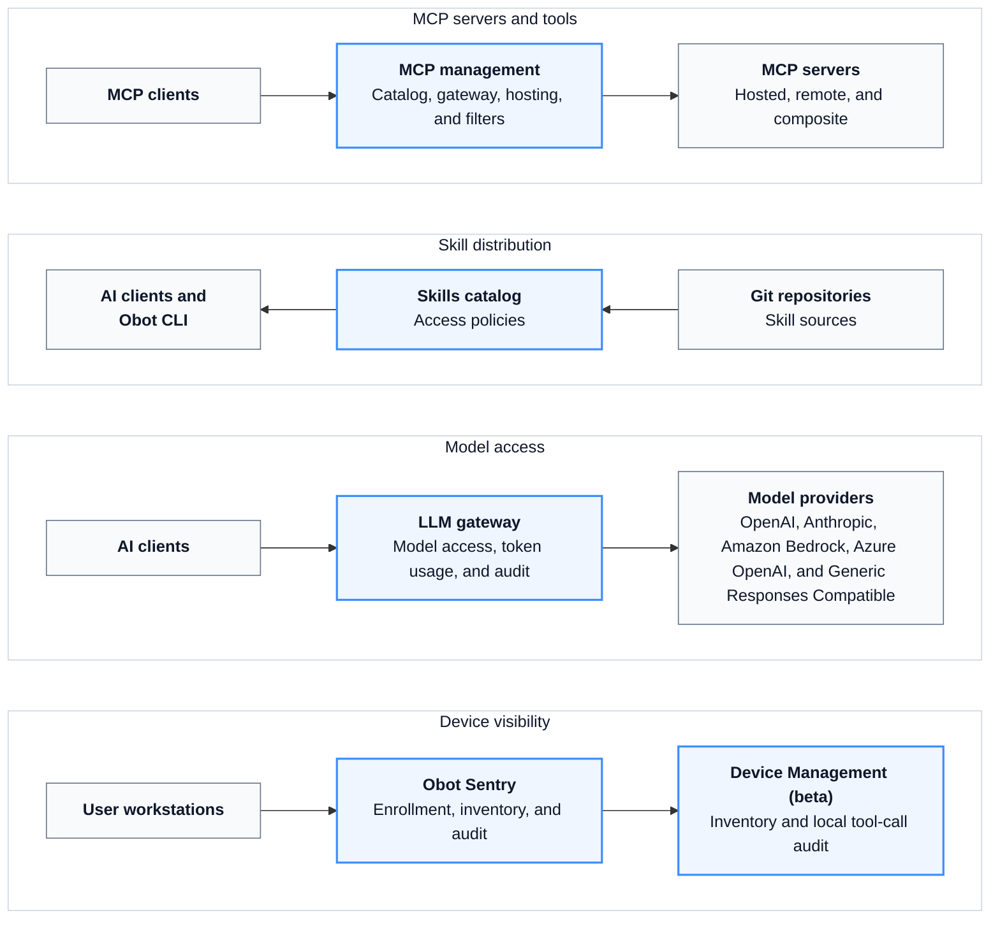

# Obot

Obot is an open-source platform for organizations to manage and govern their internal AI ecosystems. It provides shared infrastructure for distributing AI capabilities, connecting clients to models and tools, managing identities and credentials, and recording activity across centrally hosted services and user workstations.

Obot does not require an organization to standardize on one AI client or model provider. External clients such as Claude Code, Codex, Cursor, and VS Code can use the parts of the platform that apply to them.

## Architecture



## Core Capabilities

### MCP Management

- Curate MCP server catalogs through the UI or Git, and expose them through the standard MCP Registry API.
- Host `npx`, `uvx`, and containerized MCP servers on Docker or Kubernetes.
- Register remote MCP servers.
- Create composite MCP servers that expose selected tools from multiple servers.
- Control server and tool access by user or identity-provider group.
- Handle MCP OAuth, user and shared credentials, Kubernetes secret bindings, and token exchange.
- Inspect, reject, or modify MCP requests and responses with MCP or webhook filters.
- Apply domain-based egress rules to hosted MCP servers through a configured network-policy provider.

Remote and composite MCP servers are proxied by the Obot server process. Obot creates separate workloads only for MCP servers that it hosts.

### Skill Distribution

- Index Agent Skills from Git repositories.
- Grant access to individual skills, repositories, or the full catalog by user or group.
- Let users and local AI clients search and install approved skills with the Obot CLI.
- Reuse centrally managed Git credentials across skill and MCP catalog sources.

### LLM Gateway

- Connect external AI clients to OpenAI, Anthropic, Amazon Bedrock, Azure OpenAI, Microsoft Foundry, and Generic Responses Compatible providers.
- Keep provider credentials in Obot and authenticate users with scoped Obot API keys.
- Restrict the models visible and callable by each user through Model Access Policies.
- Record request outcomes, client and session metadata, token usage, and estimated model cost.

### Device Inventory and Local AI Auditing

[Obot Sentry](https://github.com/obot-platform/obot-sentry) enrolls workstations and reports the AI clients, MCP servers, skills, and plugins found on them. It can also install audit hooks for Claude Code, Codex, Cursor, and VS Code so local tool calls are recorded alongside MCP activity.

Device Management is currently beta. Obot Sentry can be installed manually or deployed to Windows systems through Microsoft Intune.

### Audit and Governance

- Record MCP requests and responses, local AI-client tool calls, and LLM Gateway requests.
- Restrict access to sensitive request and response content to users with the Auditor role.
- Filter activity by user, server, tool, provider, model, client, or session.
- Export audit data once or on a schedule to Amazon S3, Google Cloud Storage, or Azure Blob Storage.
- Track MCP usage and LLM token usage across users and resources.

## Getting Started

For local development or evaluation, run Obot with Docker:

```bash
docker run -d \
  --name obot \
  -p 8080:8080 \
  -v obot-data:/data \
  -v /var/run/docker.sock:/var/run/docker.sock \
  -e OBOT_SERVER_ENABLE_AUTHENTICATION=true \
  -e OBOT_BOOTSTRAP_TOKEN=<token> \
  ghcr.io/obot-platform/obot:latest
```

The bootstrap token must be at least six characters. If you omit `OBOT_BOOTSTRAP_TOKEN`, Obot generates one and prints it in the container logs.

Open [http://localhost:8080](http://localhost:8080), sign in with the bootstrap token, and configure an authentication provider. A model provider is required only when using the LLM Gateway.

This Docker configuration mounts the host Docker socket so Obot can launch hosted MCP servers as sibling containers. Use it only for development, evaluation, or trusted single-tenant environments. Use the Kubernetes deployment for production or multi-tenant installations.

See the [Installation Guide](https://docs.obot.ai/installation/overview) for Kubernetes, external PostgreSQL, encryption, authentication, and production configuration.

## Documentation and Community

- Documentation: [https://docs.obot.ai](https://docs.obot.ai)
- Discord: [https://discord.com/invite/9sSf4UyAMC](https://discord.com/invite/9sSf4UyAMC)

## License

Obot is licensed under the [MIT License](LICENSE).
