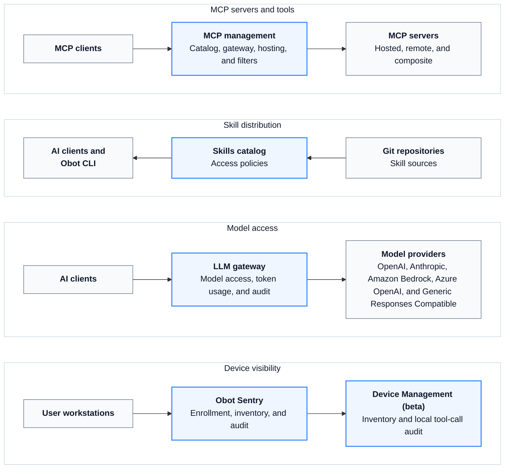

# Obot

Obot is an open-source platform for organizations to manage and govern their internal AI ecosystems. It provides shared infrastructure for distributing AI capabilities, connecting clients to models and tools, managing identities and credentials, and recording activity across centrally hosted services and user workstations.

External clients such as Claude Code, Codex, Cursor, and VS Code connect to the gateways and catalogs they need. Obot applies the organization's policies and records activity at those integration points.

## Where Obot Operates

Obot provides several independent control and observation points:



You can use only the components that fit your environment. For example, local AI clients can use the LLM Gateway without using Obot-managed MCP servers, and Device Management can inventory clients whose model traffic does not pass through Obot.

## MCP Servers and Tools

Obot manages the definition, deployment, discovery, and use of MCP servers.

- Host Node.js (`npx`), Python (`uvx`), and containerized MCP servers on Docker or Kubernetes.
- Register remote MCP servers.
- Create composite MCP servers that expose selected tools from multiple servers.
- Manage catalogs through the UI or [Git-backed sources](configuration/mcp-server-gitops.md), and serve the standard [MCP Registry API](functionality/mcp-registry-api.md).
- Grant access to servers and tools by user or identity-provider group with [MCP Access Policies](functionality/mcp-access-policies.md).
- Handle MCP OAuth, user and shared credentials, Kubernetes [secret bindings](functionality/mcp-servers.md#kubernetes-secret-bindings), and token exchange.
- Inspect, reject, or modify MCP requests and responses with [filters](functionality/filters.md).
- Restrict the domains hosted MCP servers can reach through [MCP Server Egress Control](configuration/mcp-server-egress-control.md).

See [MCP Servers](functionality/mcp-servers.md) for deployment and configuration details. See [MCP Gateway](concepts/mcp-gateway.md) for how clients connect to servers through Obot.

## Agent Skills

Obot indexes [Agent Skills](functionality/skills.md) from Git repositories and makes them available according to [Skill Access Policies](functionality/skill-access-policies.md). Policies can grant a user or group access to individual skills, an entire source repository, or all configured skills.

Users and local AI clients use the Obot CLI to search the allowed catalog and install skills. Git credentials can be managed centrally and reused across skill repositories and MCP catalog sources.

## Model Access

The [LLM Gateway](functionality/llm-gateway.md) presents provider-compatible endpoints that external AI clients can use with scoped Obot API keys. Obot keeps the upstream provider credentials and applies [Model Access Policies](functionality/model-access-policies.md) before forwarding a request.

The gateway supports:

- OpenAI and Anthropic
- Amazon Bedrock
- Azure OpenAI and Microsoft Foundry
- Generic Responses Compatible endpoints such as Ollama or LiteLLM

The model list returned to a client contains only models that the authenticated user can call. Obot records request status, client and session metadata, token counts, and estimated model cost.

## Device Inventory and Local AI Activity

[Device Management](functionality/device-management.md) is a beta capability built around [Obot Sentry](https://github.com/obot-platform/obot-sentry), a companion agent installed on user workstations.

Obot Sentry:

- Enrolls a device with device-bound credentials.
- Periodically inventories supported AI clients and their configured MCP servers, skills, and plugins.
- Installs managed audit hooks for Claude Code, Codex, Cursor, and VS Code.
- Submits local tool-call events to the same audit system used for MCP activity.

Administrators can generate manual installers or Microsoft Intune packages, issue and revoke enrollment keys, and inspect inventory by device, user, client, MCP server, or skill.

## Policies, Credentials, and Audit Data

Access policies for MCP servers, skills, and models use authenticated users and identity-provider groups. Obot can keep provider and shared-service credentials out of end-user client configuration, while per-user OAuth and configuration remain tied to the user.

[Audit Logs and Usage](functionality/audit-logs-and-usage.md) cover three types of activity:

- MCP requests and responses
- Local tool calls submitted by Obot Sentry
- LLM Gateway requests, outcomes, and token usage

Admins and Owners can inspect operational metadata. Only users with the Auditor role can access stored request and response content. MCP and local tool-call events use a normalized event format, and audit data can be exported once or on a schedule to Amazon S3, Google Cloud Storage, or Azure Blob Storage.

## Getting Started

For local development or evaluation, start Obot with Docker:

```bash
docker run -d \
  --name obot \
  -p 8080:8080 \
  -v obot-data:/data \
  -v /var/run/docker.sock:/var/run/docker.sock \
  -e OBOT_SERVER_ENABLE_AUTHENTICATION=true \
  -e OBOT_BOOTSTRAP_TOKEN=<token> \
  ghcr.io/obot-platform/obot:latest
```

The bootstrap token must be at least six characters. If you omit `OBOT_BOOTSTRAP_TOKEN`, Obot generates one and prints it in the container logs.

Open [http://localhost:8080](http://localhost:8080), sign in with the bootstrap token, and then:

1. [Configure authentication](configuration/auth-providers.md).
2. Add MCP servers, model providers, or skill sources.
3. Create access policies for the users and groups that should use them.
4. Install the [Obot CLI](installation/cli-setup.md) or configure Obot Sentry if local-client integration is required.

A model provider is required only when using the LLM Gateway.

This Docker configuration mounts the host Docker socket so Obot can launch hosted MCP servers as sibling containers. Use it only for development, evaluation, or trusted single-tenant environments. See the [Installation Guide](installation/overview.md) for Kubernetes and production deployment requirements.

## Next Steps

- [Installation Guide](installation/overview.md)
- [Functionality](functionality/overview.md)
- [User Roles](configuration/user-roles.md)
- [Server Configuration](configuration/server-configuration.md)
